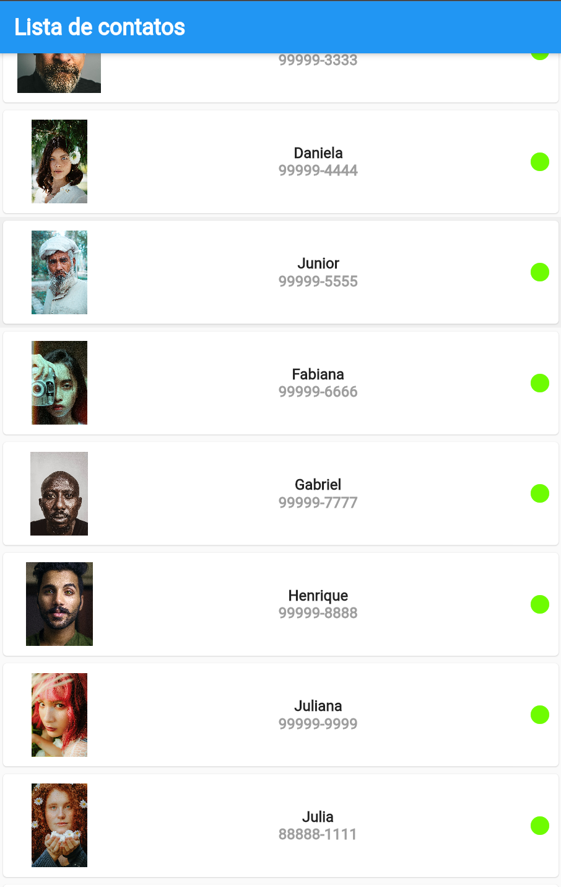
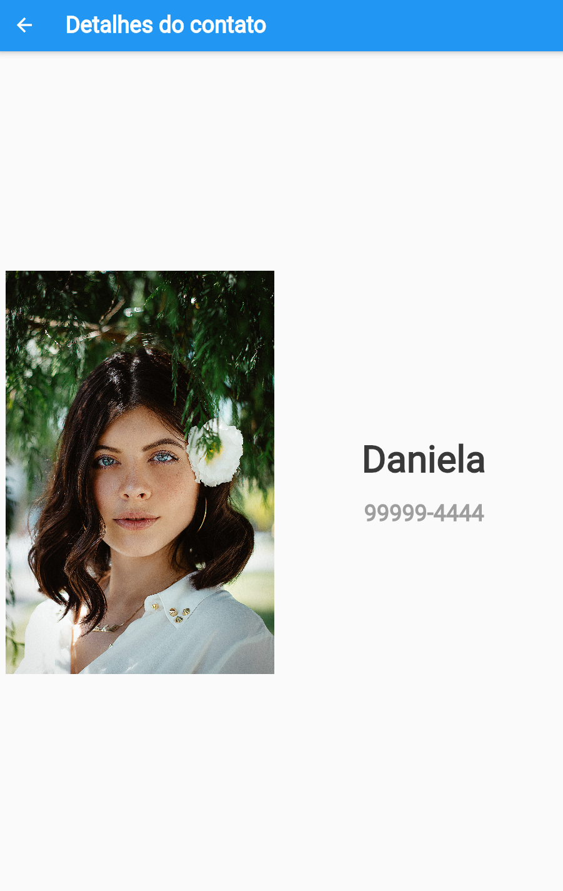

# Lista de Contatos

Este é um aplicativo simples em Flutter para Android que lista alguns contatos do WhatsApp. Ele apresenta uma lista de 15 contatos, cada um com uma imagem, o nome e o número de telefone. Ao clicar em um contato, você é levado para uma nova tela que exibe o nome do contato no `AppBar`.

## Funcionalidades

- Listagem de 15 contatos do WhatsApp
- Cada contato é representado por uma imagem, nome e número de telefone
- Ao clicar em um contato, uma nova tela é aberta com o nome do contato,imagem e número de telefone  no `AppBar`

## Como executar

Para executar o aplicativo, siga os seguintes passos:

1. Certifique-se de ter o Flutter instalado em sua máquina. Para mais informações, consulte a [documentação oficial do Flutter](https://flutter.dev/docs/get-started/install).
2. Clone este repositório em sua máquina usando o Git ou baixe o ZIP.
3. Abra o projeto em seu editor de código preferido.
4. Execute o aplicativo em seu dispositivo ou emulador usando o comando `flutter run` no terminal.

## Screenshots

Aqui estão algumas screenshots do aplicativo em execução:

## Contribuição

Este é um projeto de código aberto e contribuições são sempre bem-vindas! Sinta-se à vontade para abrir uma _issue_ ou enviar um _pull request_.

## Licença

Este projeto é licenciado sob a [MIT License](LICENSE).
